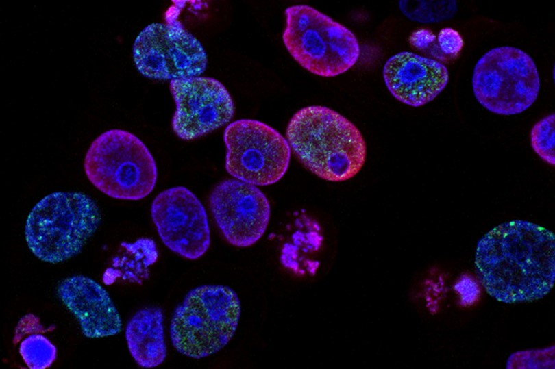

# Cancer Early Detection

## Problem Statement

The Indian Council of Medical Research (ICMR) aims to investigate the causes of various types of cancers, including breast cancer, renal cancer, colon cancer, lung cancer, and prostate cancer, which have become a growing concern in recent years. The objective is to identify the genetic factors responsible for each type of cancer, enabling early detection and reducing the fatality rate.

## Dataset Details

The dataset consists of 802 samples from individuals diagnosed with different types of cancer. Each sample contains the expression values of more than 20,000 genes. The samples are categorized into the following types of tumors: BRCA, KIRC, COAD, LUAD, and PRAD.

## Steps

### Step 1: Exploratory Data Analysis

- Merge the datasets.
- Visualize the merged dataset as a hierarchically-clustered heatmap.
- Perform null-hypothesis testing.

### Step 2: Dimensionality Reduction

Given the large number of genes (20,000+) in each sample, it is not necessary to include all gene expression values for analyzing each cancer type. The goal is to identify a smaller set of informative attributes for fitting multiclass classification models. Dimensionality reduction techniques such as PCA, LDA, and t-SNE will be employed.

### Step 3: Clustering Genes and Samples

The objective is to identify groups of genes that exhibit similar behavior across samples and examine the distribution of samples corresponding to each cancer type. Various clustering techniques, including k-means, hierarchical, and mean-shift clustering, will be applied to genes and samples.

- Identify genes with similar expression values across all samples.
- Identify genes with similar expression values across samples of each cancer type.
- Identify samples belonging to the same cancer type and cluster.

### Step 4: Building Classification Model(s) with Feature Selection

The final task involves constructing robust classification models to identify each type of cancer.

- Build classification models using multiclass SVM, Random Forest, and Deep Neural Network.
- Apply feature selection algorithms (forward selection and backward elimination) using the selected attributes from Step 2.
- Validate the selected genes using statistical significance testing (t-test for one vs. all and F-test).

By completing these steps, we aim to contribute to early cancer detection by developing effective classification models that can accurately identify different types of cancer based on genetic attributes.
